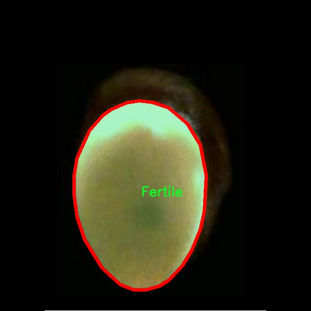
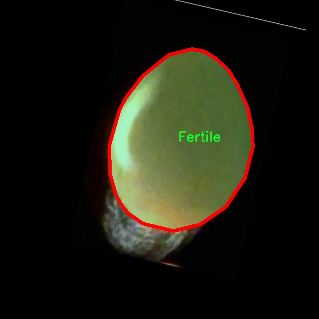

# 蛋类孵化状态识别图像分割系统： yolov8-seg-timm

### 1.研究背景与意义

[参考博客](https://gitee.com/YOLOv8_YOLOv11_Segmentation_Studio/projects)

[博客来源](https://kdocs.cn/l/cszuIiCKVNis)

研究背景与意义

随着全球人口的不断增长，食品安全和农业生产效率成为了当今社会亟待解决的重要问题。蛋类作为一种重要的动物蛋白来源，其孵化过程的有效管理直接影响到畜牧业的生产效率和经济效益。因此，开发一种高效、准确的蛋类孵化状态识别系统显得尤为重要。传统的人工检查方法不仅耗时耗力，而且容易受到主观因素的影响，导致识别结果的不一致性和准确性不足。为此，基于计算机视觉和深度学习技术的自动化识别系统应运而生，成为解决这一问题的有效途径。

在众多深度学习模型中，YOLO（You Only Look Once）系列因其实时性和高效性而受到广泛关注。YOLOv8作为该系列的最新版本，进一步提升了目标检测和图像分割的性能，尤其在处理复杂场景和多类别目标时表现出色。然而，针对蛋类孵化状态的识别，现有的YOLOv8模型尚未进行专门的优化和改进。因此，基于改进YOLOv8的蛋类孵化状态识别图像分割系统的研究，具有重要的理论和实践意义。

本研究将利用一个包含1100张图像的数据集，该数据集分为“Fertile”（可孵化）和“Unfertile”（不可孵化）两类。这一数据集的构建为模型的训练和验证提供了坚实的基础。通过对图像进行实例分割，不仅可以识别出蛋类的孵化状态，还能为后续的孵化管理提供数据支持。改进YOLOv8模型的关键在于如何有效地处理图像中的噪声、光照变化以及不同角度的蛋类图像，从而提高识别的准确性和鲁棒性。

此外，蛋类孵化状态的自动识别不仅可以提高孵化场的管理效率，还能为养殖户提供科学依据，帮助他们做出更为合理的决策。这一系统的推广应用，将有助于降低人力成本，提高孵化成功率，从而推动整个蛋类产业的可持续发展。

在学术研究方面，本研究将为计算机视觉领域的实例分割技术提供新的应用案例，同时也为YOLOv8模型的改进与优化提供了新的思路和方法。通过对蛋类孵化状态的深入研究，能够进一步丰富深度学习在农业领域的应用场景，推动相关技术的进步与发展。

综上所述，基于改进YOLOv8的蛋类孵化状态识别图像分割系统的研究，不仅具有重要的现实意义，也为相关领域的学术研究提供了新的视角和思路。通过这一研究，期望能够为农业现代化进程贡献一份力量，推动智能化技术在传统农业中的应用，提升农业生产的效率与安全性。

### 2.图片演示


注意：本项目提供完整的训练源码数据集和训练教程,由于此博客编辑较早,暂不提供权重文件（best.pt）,需要按照6.训练教程进行训练后实现上图效果。

### 3.视频演示

[3.1 视频演示](https://www.bilibili.com/video/BV1UpzgYLEHs/)

### 4.数据集信息

##### 4.1 数据集类别数＆类别名

nc: 2
names: ['Fertile', 'Unfertile']


##### 4.2 数据集信息简介

数据集信息展示

在现代农业科技的快速发展中，蛋类孵化状态的准确识别对于提高孵化效率和蛋品质量至关重要。本研究所使用的数据集名为“Egg Fertility”，旨在为改进YOLOv8-seg的蛋类孵化状态识别图像分割系统提供强有力的支持。该数据集包含两类主要的标注信息，分别为“Fertile”（可孵化）和“Unfertile”（不可孵化），通过这两类的有效区分，系统能够在实际应用中实现对蛋类孵化状态的高效监测与评估。

“Egg Fertility”数据集的构建基于对大量蛋类图像的收集与标注，确保了数据的多样性和代表性。数据集中包含的图像不仅涵盖了不同种类的蛋类，还包括了在不同光照、角度和背景下拍摄的样本。这种多样性为模型的训练提供了丰富的特征信息，使得最终的图像分割系统能够更好地适应各种实际场景。通过对这些图像进行精确的标注，研究人员能够为YOLOv8-seg模型提供清晰的学习目标，从而提高模型在蛋类孵化状态识别中的准确性和鲁棒性。

在数据集的标注过程中，采用了先进的图像处理技术，以确保每一张图像中的“Fertile”和“Unfertile”类别都得到了准确的识别和分割。这一过程不仅需要专业的知识和技能，还要求标注人员具备对蛋类孵化生物学的基本理解，以便在图像中正确识别出孵化状态的微妙差异。此外，数据集的构建还考虑到了数据的平衡性，确保每一类样本数量的相对均衡，从而避免模型在训练过程中出现偏向某一类别的现象。

在实际应用中，经过YOLOv8-seg模型训练后的系统能够实时分析输入的蛋类图像，并快速判断其孵化状态。这一过程不仅提高了孵化场所的工作效率，还为养殖户提供了科学依据，帮助他们做出更为精准的管理决策。通过对“Egg Fertility”数据集的深入研究，研究团队希望能够推动蛋类孵化技术的进一步发展，促进农业智能化的进程。

总之，“Egg Fertility”数据集不仅为YOLOv8-seg模型的训练提供了坚实的基础，也为未来在蛋类孵化状态识别领域的研究奠定了重要的理论和实践基础。随着数据集的不断完善和技术的不断进步，期待这一系统能够在更广泛的农业应用中发挥重要作用，助力现代农业的可持续发展。






### 5.项目依赖环境部署教程（零基础手把手教学）

[5.1 环境部署教程链接（零基础手把手教学）](https://www.bilibili.com/video/BV1jG4Ve4E9t/?vd_source=bc9aec86d164b67a7004b996143742dc)


[5.2 安装Python虚拟环境创建和依赖库安装视频教程链接（零基础手把手教学）](https://www.bilibili.com/video/BV1nA4VeYEze/?vd_source=bc9aec86d164b67a7004b996143742dc)

### 6.手把手YOLOV8-seg训练视频教程（零基础手把手教学）

[6.1 手把手YOLOV8-seg训练视频教程（零基础小白有手就能学会）](https://www.bilibili.com/video/BV1cA4VeYETe/?vd_source=bc9aec86d164b67a7004b996143742dc)


按照上面的训练视频教程链接加载项目提供的数据集，运行train.py即可开始训练



     Epoch   gpu_mem       box       obj       cls    labels  img_size
     1/200     0G   0.01576   0.01955  0.007536        22      1280: 100%|██████████| 849/849 [14:42<00:00,  1.04s/it]
               Class     Images     Labels          P          R     mAP@.5 mAP@.5:.95: 100%|██████████| 213/213 [01:14<00:00,  2.87it/s]
                 all       3395      17314      0.994      0.957      0.0957      0.0843

     Epoch   gpu_mem       box       obj       cls    labels  img_size
     2/200     0G   0.01578   0.01923  0.007006        22      1280: 100%|██████████| 849/849 [14:44<00:00,  1.04s/it]
               Class     Images     Labels          P          R     mAP@.5 mAP@.5:.95: 100%|██████████| 213/213 [01:12<00:00,  2.95it/s]
                 all       3395      17314      0.996      0.956      0.0957      0.0845

     Epoch   gpu_mem       box       obj       cls    labels  img_size
     3/200     0G   0.01561    0.0191  0.006895        27      1280: 100%|██████████| 849/849 [10:56<00:00,  1.29it/s]
               Class     Images     Labels          P          R     mAP@.5 mAP@.5:.95: 100%|███████   | 187/213 [00:52<00:00,  4.04it/s]
                 all       3395      17314      0.996      0.957      0.0957      0.0845


### 7.50+种全套YOLOV8-seg创新点加载调参实验视频教程（一键加载写好的改进模型的配置文件）

[7.1 50+种全套YOLOV8-seg创新点加载调参实验视频教程（一键加载写好的改进模型的配置文件）](https://www.bilibili.com/video/BV1Hw4VePEXv/?vd_source=bc9aec86d164b67a7004b996143742dc)

### YOLOV8-seg算法简介

原始YOLOv8-seg算法原理

YOLOv8-seg算法是目标检测领域的最新进展，基于YOLOv8的架构，进一步增强了对图像分割任务的处理能力。作为YOLO系列的最新版本，YOLOv8-seg在继承了YOLOv5和YOLOv7的优良特性基础上，结合了新的设计理念和技术，旨在实现更高效的目标检测和分割效果。其整体结构依然遵循输入层、主干网络、特征融合层和解耦头的设计框架，但在每个部分都进行了优化和改进，以适应更复杂的视觉任务。

在YOLOv8-seg的主干网络部分，依然采用了CSPDarknet的思想，保持了YOLOv5的基础架构，但将C3模块替换为C2f模块。这一变更不仅减轻了模型的重量，同时也确保了检测精度的提升。C2f模块的设计灵感来源于YOLOv7的ELAN结构，增加了多条shortcut连接，显著改善了深层模型中的梯度流动问题，从而提升了特征提取的能力。C2f模块通过多个分支的设计，能够更好地捕捉图像中的细节信息和上下文信息，使得网络在处理复杂场景时，能够更准确地进行目标检测和分割。

在特征融合层，YOLOv8-seg采用了PAN-FPN结构，增强了对多尺度特征的融合能力。该结构通过自下而上的特征融合，结合了高层特征和中层特征，确保了在不同尺度下对目标的有效检测。在此过程中，YOLOv8-seg去除了YOLOv5中上采样阶段的1x1卷积，直接将高层特征进行上采样后与中层特征进行拼接，这种设计使得网络能够充分利用不同层次的特征信息，进而提升了目标检测的准确性和鲁棒性。

YOLOv8-seg的另一个显著特点是其采用了Anchor-Free的思想，摒弃了传统的Anchor-Base方法。这一转变使得模型在处理不同尺寸和形状的目标时，能够更加灵活和高效。通过引入Task-Aligned的样本匹配策略，YOLOv8-seg能够更好地适应不同的任务需求，提升了样本匹配的精度。此外，YOLOv8-seg在损失函数的设计上也进行了创新，采用了VFLLoss作为分类损失，结合DFLLoss和CIoULoss进行边框回归，进一步提高了模型的学习效果和检测性能。

在数据预处理方面，YOLOv8-seg延续了YOLOv5的策略，采用了多种数据增强手段，如马赛克增强、混合增强、空间扰动和颜色扰动等。这些增强手段有效地提升了模型的泛化能力，使得YOLOv8-seg在面对不同的输入图像时，能够保持较高的检测精度。

在解耦头的设计上，YOLOv8-seg借鉴了YOLOX和YOLOv6的解耦头结构，取消了objectness分支，通过边框回归和目标分类两个部分进行解耦处理。这种设计使得模型在进行目标检测时，能够更加高效地进行分类和回归，减少了计算的复杂性，同时提升了检测的速度和准确性。

总的来说，YOLOv8-seg算法通过对YOLOv8的多项改进，展现了其在目标检测和图像分割任务中的强大能力。其主干网络的优化、特征融合的增强、Anchor-Free的创新以及解耦头的设计，都使得YOLOv8-seg在处理复杂视觉任务时，能够更为精准和高效。随着这一算法的推广和应用，预计将为目标检测和图像分割领域带来新的突破和发展。


### 9.系统功能展示（检测对象为举例，实际内容以本项目数据集为准）

图9.1.系统支持检测结果表格显示

  图9.2.系统支持置信度和IOU阈值手动调节

  图9.3.系统支持自定义加载权重文件best.pt(需要你通过步骤5中训练获得)

  图9.4.系统支持摄像头实时识别

  图9.5.系统支持图片识别

  图9.6.系统支持视频识别

  图9.7.系统支持识别结果文件自动保存

  图9.8.系统支持Excel导出检测结果数据


### 10.50+种全套YOLOV8-seg创新点原理讲解（非科班也可以轻松写刊发刊，V11版本正在科研待更新）

#### 10.1 由于篇幅限制，每个创新点的具体原理讲解就不一一展开，具体见下列网址中的创新点对应子项目的技术原理博客网址【Blog】：


[10.1 50+种全套YOLOV8-seg创新点原理讲解链接](https://gitee.com/qunmasj/good)

#### 10.2 部分改进模块原理讲解(完整的改进原理见上图和技术博客链接)【如果此小节的图加载失败可以通过CSDN或者Github搜索该博客的标题访问原始博客，原始博客图片显示正常】

### YOLOv8简介
#### Backbone
Darknet-53
53指的是“52层卷积”+output layer。

借鉴了其他算法的这些设计思想

借鉴了VGG的思想，使用了较多的3×3卷积，在每一次池化操作后，将通道数翻倍；

借鉴了network in network的思想，使用全局平均池化（global average pooling）做预测，并把1×1的卷积核置于3×3的卷积核之间，用来压缩特征；（我没找到这一步体现在哪里）


使用了批归一化层稳定模型训练，加速收敛，并且起到正则化作用。

    以上三点为Darknet19借鉴其他模型的点。Darknet53当然是在继承了Darknet19的这些优点的基础上再新增了下面这些优点的。因此列在了这里

借鉴了ResNet的思想，在网络中大量使用了残差连接，因此网络结构可以设计的很深，并且缓解了训练中梯度消失的问题，使得模型更容易收敛。

使用步长为2的卷积层代替池化层实现降采样。（这一点在经典的Darknet-53上是很明显的，output的长和宽从256降到128，再降低到64，一路降低到8，应该是通过步长为2的卷积层实现的；在YOLOv8的卷积层中也有体现，比如图中我标出的这些位置）

#### 特征融合

模型架构图如下

  Darknet-53的特点可以这样概括：（Conv卷积模块+Residual Block残差块）串行叠加4次

  Conv卷积层+Residual Block残差网络就被称为一个stage


上面红色指出的那个，原始的Darknet-53里面有一层 卷积，在YOLOv8里面，把一层卷积移除了

为什么移除呢？

        原始Darknet-53模型中间加的这个卷积层做了什么？滤波器（卷积核）的个数从 上一个卷积层的512个，先增加到1024个卷积核，然后下一层卷积的卷积核的个数又降低到512个

        移除掉这一层以后，少了1024个卷积核，就可以少做1024次卷积运算，同时也少了1024个3×3的卷积核的参数，也就是少了9×1024个参数需要拟合。这样可以大大减少了模型的参数，（相当于做了轻量化吧）

        移除掉这个卷积层，可能是因为作者发现移除掉这个卷积层以后，模型的score有所提升，所以才移除掉的。为什么移除掉以后，分数有所提高呢？可能是因为多了这些参数就容易，参数过多导致模型在训练集删过拟合，但是在测试集上表现很差，最终模型的分数比较低。你移除掉这个卷积层以后，参数减少了，过拟合现象不那么严重了，泛化能力增强了。当然这个是，拿着你做实验的结论，反过来再找补，再去强行解释这种现象的合理性。


通过MMdetection官方绘制册这个图我们可以看到，进来的这张图片经过一个“Feature Pyramid Network(简称FPN)”，然后最后的P3、P4、P5传递给下一层的Neck和Head去做识别任务。 PAN（Path Aggregation Network）


“FPN是自顶向下，将高层的强语义特征传递下来。PAN就是在FPN的后面添加一个自底向上的金字塔，对FPN补充，将低层的强定位特征传递上去，

FPN是自顶（小尺寸，卷积次数多得到的结果，语义信息丰富）向下（大尺寸，卷积次数少得到的结果），将高层的强语义特征传递下来，对整个金字塔进行增强，不过只增强了语义信息，对定位信息没有传递。PAN就是针对这一点，在FPN的后面添加一个自底（卷积次数少，大尺寸）向上（卷积次数多，小尺寸，语义信息丰富）的金字塔，对FPN补充，将低层的强定位特征传递上去，又被称之为“双塔战术”。

FPN层自顶向下传达强语义特征，而特征金字塔则自底向上传达强定位特征，两两联手，从不同的主干层对不同的检测层进行参数聚合,这样的操作确实很皮。
#### 自底向上增强


而 PAN（Path Aggregation Network）是对 FPN 的一种改进，它的设计理念是在 FPN 后面添加一个自底向上的金字塔。PAN 引入了路径聚合的方式，通过将浅层特征图（低分辨率但语义信息较弱）和深层特征图（高分辨率但语义信息丰富）进行聚合，并沿着特定的路径传递特征信息，将低层的强定位特征传递上去。这样的操作能够进一步增强多尺度特征的表达能力，使得 PAN 在目标检测任务中表现更加优秀。


### Gold-YOLO简介
YOLO系列模型面世至今已有8年，由于其优异的性能，已成为目标检测领域的标杆。在系列模型经过十多个不同版本的改进发展逐渐稳定完善的今天，研究人员更多关注于单个计算模块内结构的精细调整，或是head部分和训练方法上的改进。但这并不意味着现有模式已是最优解。

当前YOLO系列模型通常采用类FPN方法进行信息融合，而这一结构在融合跨层信息时存在信息损失的问题。针对这一问题，我们提出了全新的信息聚集-分发（Gather-and-Distribute Mechanism）GD机制，通过在全局视野上对不同层级的特征进行统一的聚集融合并分发注入到不同层级中，构建更加充分高效的信息交互融合机制，并基于GD机制构建了Gold-YOLO。在COCO数据集中，我们的Gold-YOLO超越了现有的YOLO系列，实现了精度-速度曲线上的SOTA。


精度和速度曲线（TensorRT7）


精度和速度曲线（TensorRT8）
传统YOLO的问题
在检测模型中，通常先经过backbone提取得到一系列不同层级的特征，FPN利用了backbone的这一特点，构建了相应的融合结构：不层级的特征包含着不同大小物体的位置信息，虽然这些特征包含的信息不同，但这些特征在相互融合后能够互相弥补彼此缺失的信息，增强每一层级信息的丰富程度，提升网络性能。

原始的FPN结构由于其层层递进的信息融合模式，使得相邻层的信息能够充分融合，但也导致了跨层信息融合存在问题：当跨层的信息进行交互融合时，由于没有直连的交互通路，只能依靠中间层充当“中介”进行融合，导致了一定的信息损失。之前的许多工作中都关注到了这一问题，而解决方案通常是通过添加shortcut增加更多的路径，以增强信息流动。

然而传统的FPN结构即便改进后，由于网络中路径过多，且交互方式不直接，基于FPN思想的信息融合结构仍然存在跨层信息交互困难和信息损失的问题。

#### Gold-YOLO：全新的信息融合交互机制


#### Gold-YOLO架构
参考该博客提出的一种全新的信息交互融合机制：信息聚集-分发机制(Gather-and-Distribute Mechanism)。该机制通过在全局上融合不同层次的特征得到全局信息，并将全局信息注入到不同层级的特征中，实现了高效的信息交互和融合。在不显著增加延迟的情况下GD机制显著增强了Neck部分的信息融合能力，提高了模型对不同大小物体的检测能力。

GD机制通过三个模块实现：信息对齐模块(FAM)、信息融合模块(IFM)和信息注入模块(Inject)。

信息对齐模块负责收集并对齐不同层级不同大小的特征

信息融合模块通过使用卷积或Transformer算子对对齐后的的特征进行融合，得到全局信息

信息注入模块将全局信息注入到不同层级中

在Gold-YOLO中，针对模型需要检测不同大小的物体的需要，并权衡精度和速度，我们构建了两个GD分支对信息进行融合：低层级信息聚集-分发分支(Low-GD)和高层级信息聚集-分发分支(High-GD)，分别基于卷积和transformer提取和融合特征信息。

此外,为了促进局部信息的流动，我们借鉴现有工作，构建了一个轻量级的邻接层融合模块，该模块在局部尺度上结合了邻近层的特征，进一步提升了模型性能。我们还引入并验证了预训练方法对YOLO模型的有效性，通过在ImageNet 1K上使用MAE方法对主干进行预训练，显著提高了模型的收敛速度和精度。


### 11.项目核心源码讲解（再也不用担心看不懂代码逻辑）

#### 11.1 ultralytics\utils\callbacks\hub.py

以下是对代码的核心部分进行的提炼和详细注释：

```python
# Ultralytics YOLO 🚀, AGPL-3.0 license

import json
from time import time
from ultralytics.hub.utils import HUB_WEB_ROOT, PREFIX, events
from ultralytics.utils import LOGGER, SETTINGS

def on_fit_epoch_end(trainer):
    """在每个训练周期结束时上传训练进度指标。"""
    session = getattr(trainer, 'hub_session', None)  # 获取训练会话
    if session:
        # 获取训练损失和指标
        all_plots = {**trainer.label_loss_items(trainer.tloss, prefix='train'), **trainer.metrics}
        if trainer.epoch == 0:
            from ultralytics.utils.torch_utils import model_info_for_loggers
            # 在第一个周期时，添加模型信息
            all_plots = {**all_plots, **model_info_for_loggers(trainer)}
        
        # 将当前周期的指标数据存入队列
        session.metrics_queue[trainer.epoch] = json.dumps(all_plots)
        
        # 检查是否超过上传速率限制
        if time() - session.timers['metrics'] > session.rate_limits['metrics']:
            session.upload_metrics()  # 上传指标
            session.timers['metrics'] = time()  # 重置计时器
            session.metrics_queue = {}  # 重置队列

def on_model_save(trainer):
    """将检查点保存到Ultralytics HUB，并进行速率限制。"""
    session = getattr(trainer, 'hub_session', None)  # 获取训练会话
    if session:
        is_best = trainer.best_fitness == trainer.fitness  # 判断当前模型是否是最佳模型
        # 检查是否超过上传速率限制
        if time() - session.timers['ckpt'] > session.rate_limits['ckpt']:
            LOGGER.info(f'{PREFIX}上传检查点 {HUB_WEB_ROOT}/models/{session.model_id}')
            session.upload_model(trainer.epoch, trainer.last, is_best)  # 上传模型
            session.timers['ckpt'] = time()  # 重置计时器

def on_train_end(trainer):
    """在训练结束时上传最终模型和指标到Ultralytics HUB。"""
    session = getattr(trainer, 'hub_session', None)  # 获取训练会话
    if session:
        LOGGER.info(f'{PREFIX}同步最终模型...')
        # 上传最终模型和指标
        session.upload_model(trainer.epoch, trainer.best, map=trainer.metrics.get('metrics/mAP50-95(B)', 0), final=True)
        session.alive = False  # 停止心跳
        LOGGER.info(f'{PREFIX}完成 ✅\n'
                    f'{PREFIX}查看模型在 {HUB_WEB_ROOT}/models/{session.model_id} 🚀')

# 定义回调函数字典
callbacks = {
    'on_fit_epoch_end': on_fit_epoch_end,
    'on_model_save': on_model_save,
    'on_train_end': on_train_end,
} if SETTINGS['hub'] is True else {}  # 验证是否启用
```

### 代码核心部分说明：

1. **on_fit_epoch_end**:
   - 该函数在每个训练周期结束时被调用，用于上传训练过程中的指标。
   - 它会检查当前周期的损失和指标，并在第一个周期时添加模型信息。
   - 如果上传的时间间隔超过设定的速率限制，则会上传当前的指标数据。

2. **on_model_save**:
   - 该函数用于在训练过程中保存模型的检查点。
   - 它会判断当前模型是否是最佳模型，并在满足速率限制的情况下上传模型。

3. **on_train_end**:
   - 该函数在训练结束时被调用，用于上传最终的模型和指标。
   - 它会停止心跳信号并输出完成信息。

4. **callbacks字典**:
   - 该字典存储了各个回调函数的映射关系，只有在配置中启用hub时才会被定义。

这些核心部分负责训练过程中的关键操作，包括上传训练指标、保存模型检查点和最终模型的上传。

这个文件是Ultralytics YOLO项目中的一个回调函数模块，主要用于在训练过程中与Ultralytics HUB进行交互，记录和上传模型训练的相关信息。文件中定义了一系列回调函数，这些函数在特定的训练阶段被调用，以实现日志记录、模型上传和进度监控等功能。

首先，文件导入了一些必要的模块，包括`json`和`time`，以及Ultralytics HUB和其他工具的相关功能。接着，定义了一些回调函数：

- `on_pretrain_routine_end(trainer)`：在预训练例程结束时调用，主要用于记录信息并启动上传速率限制的计时器。如果训练器有与HUB的会话，则会记录模型的访问链接，并初始化计时器。

- `on_fit_epoch_end(trainer)`：在每个训练周期结束时调用，负责上传训练进度的指标。在每个周期结束时，它会收集训练损失和其他指标，并将其序列化为JSON格式上传。如果上传间隔超过设定的速率限制，则会执行上传操作，并重置计时器和指标队列。

- `on_model_save(trainer)`：在模型保存时调用，负责将检查点上传到Ultralytics HUB，并控制上传的速率。如果当前的训练状态是最佳状态，则会标记该模型为最佳模型，并在满足速率限制的情况下进行上传。

- `on_train_end(trainer)`：在训练结束时调用，上传最终模型和指标到Ultralytics HUB。它会记录上传的过程，并在完成后停止心跳检测，表示训练过程已结束。

- `on_train_start(trainer)`、`on_val_start(validator)`、`on_predict_start(predictor)`和`on_export_start(exporter)`：这些函数在训练、验证、预测和导出开始时调用，主要用于触发相关事件。

最后，文件定义了一个`callbacks`字典，将上述回调函数与相应的事件名称关联起来。这个字典的生成依赖于设置中的`hub`选项，只有在该选项为真时，回调函数才会被注册。

总体来说，这个文件的主要功能是实现与Ultralytics HUB的交互，确保在训练过程中能够实时记录和上传模型的训练状态和性能指标，以便于后续的模型管理和监控。

#### 11.2 ultralytics\models\sam\predict.py

以下是经过简化和注释的核心代码部分，主要包括`Predictor`类及其重要方法。

```python
import numpy as np
import torch
import torch.nn.functional as F
import torchvision

from ultralytics.data.augment import LetterBox
from ultralytics.engine.predictor import BasePredictor
from ultralytics.engine.results import Results
from ultralytics.utils import ops
from ultralytics.utils.torch_utils import select_device

class Predictor(BasePredictor):
    """
    Predictor类用于Segment Anything Model (SAM)的推理，继承自BasePredictor。
    该类提供了一个接口，用于图像分割任务的模型推理。
    """

    def __init__(self, cfg=DEFAULT_CFG, overrides=None, _callbacks=None):
        """
        初始化Predictor，设置配置、覆盖和回调。
        """
        if overrides is None:
            overrides = {}
        overrides.update(dict(task='segment', mode='predict', imgsz=1024))
        super().__init__(cfg, overrides, _callbacks)
        self.args.retina_masks = True  # 启用retina_masks以获得最佳结果
        self.im = None  # 输入图像
        self.features = None  # 提取的图像特征
        self.prompts = {}  # 存储各种提示类型
        self.segment_all = False  # 控制是否分割所有对象

    def preprocess(self, im):
        """
        预处理输入图像以进行模型推理。
        """
        if self.im is not None:
            return self.im
        not_tensor = not isinstance(im, torch.Tensor)
        if not_tensor:
            im = np.stack(self.pre_transform(im))  # 转换为张量
            im = im[..., ::-1].transpose((0, 3, 1, 2))  # 变换通道顺序
            im = torch.from_numpy(im)

        im = im.to(self.device)  # 移动到设备
        im = im.half() if self.model.fp16 else im.float()  # 转换为半精度或单精度
        if not_tensor:
            im = (im - self.mean) / self.std  # 归一化
        return im

    def inference(self, im, bboxes=None, points=None, labels=None, masks=None, multimask_output=False, *args, **kwargs):
        """
        根据给定的输入提示执行图像分割推理。
        """
        # 从self.prompts中提取提示
        bboxes = self.prompts.pop('bboxes', bboxes)
        points = self.prompts.pop('points', points)
        masks = self.prompts.pop('masks', masks)

        if all(i is None for i in [bboxes, points, masks]):
            return self.generate(im, *args, **kwargs)  # 如果没有提示，则生成

        return self.prompt_inference(im, bboxes, points, labels, masks, multimask_output)

    def prompt_inference(self, im, bboxes=None, points=None, labels=None, masks=None, multimask_output=False):
        """
        基于提示（如边界框、点和掩码）执行图像分割推理。
        """
        features = self.model.image_encoder(im) if self.features is None else self.features  # 提取图像特征

        # 处理输入提示
        if points is not None:
            points = torch.as_tensor(points, dtype=torch.float32, device=self.device)
            points = points[None] if points.ndim == 1 else points
            if labels is None:
                labels = np.ones(points.shape[0])  # 默认所有标签为前景
            labels = torch.as_tensor(labels, dtype=torch.int32, device=self.device)
        
        # 嵌入提示并预测掩码
        sparse_embeddings, dense_embeddings = self.model.prompt_encoder(points=points, boxes=bboxes, masks=masks)
        pred_masks, pred_scores = self.model.mask_decoder(
            image_embeddings=features,
            sparse_prompt_embeddings=sparse_embeddings,
            dense_prompt_embeddings=dense_embeddings,
            multimask_output=multimask_output,
        )

        return pred_masks.flatten(0, 1), pred_scores.flatten(0, 1)  # 返回预测的掩码和分数

    def generate(self, im, crop_n_layers=0, crop_overlap_ratio=512 / 1500, points_batch_size=64, conf_thres=0.88):
        """
        使用SAM执行图像分割。
        """
        self.segment_all = True  # 设置为分割所有对象
        ih, iw = im.shape[2:]  # 获取输入图像的高度和宽度
        crop_regions, layer_idxs = generate_crop_boxes((ih, iw), crop_n_layers, crop_overlap_ratio)  # 生成裁剪区域

        pred_masks, pred_scores, pred_bboxes = [], [], []  # 存储预测结果
        for crop_region, layer_idx in zip(crop_regions, layer_idxs):
            # 对每个裁剪区域进行推理
            crop_im = F.interpolate(im[..., y1:y2, x1:x2], (ih, iw), mode='bilinear', align_corners=False)
            # 进行点推理
            crop_masks, crop_scores, crop_bboxes = self.prompt_inference(crop_im, points=points_for_image, multimask_output=True)

            # 处理和合并结果
            pred_masks.append(crop_masks)
            pred_bboxes.append(crop_bboxes)
            pred_scores.append(crop_scores)

        # 合并所有掩码和边界框
        pred_masks = torch.cat(pred_masks)
        pred_bboxes = torch.cat(pred_bboxes)
        pred_scores = torch.cat(pred_scores)

        return pred_masks, pred_scores, pred_bboxes  # 返回最终的掩码、分数和边界框

    def setup_model(self, model, verbose=True):
        """
        初始化SAM模型以进行推理。
        """
        device = select_device(self.args.device, verbose=verbose)  # 选择设备
        model.eval()  # 设置模型为评估模式
        self.model = model.to(device)  # 移动模型到设备
        self.mean = torch.tensor([123.675, 116.28, 103.53]).view(-1, 1, 1).to(device)  # 归一化均值
        self.std = torch.tensor([58.395, 57.12, 57.375]).view(-1, 1, 1).to(device)  # 归一化标准差

    def postprocess(self, preds, img, orig_imgs):
        """
        后处理SAM的推理输出以生成对象检测掩码和边界框。
        """
        pred_masks, pred_scores = preds[:2]  # 提取掩码和分数
        results = []
        for i, masks in enumerate([pred_masks]):
            orig_img = orig_imgs[i]
            masks = ops.scale_masks(masks[None].float(), orig_img.shape[:2], padding=False)[0]  # 缩放掩码
            results.append(Results(orig_img, masks=masks))  # 创建结果对象
        return results  # 返回结果列表
```

### 代码说明：
1. **Predictor类**：负责图像分割的推理，继承自`BasePredictor`。
2. **初始化方法**：设置模型配置和默认参数。
3. **预处理方法**：将输入图像转换为适合模型的格式，并进行归一化。
4. **推理方法**：根据输入提示（如边界框、点等）执行图像分割。
5. **生成方法**：处理整个图像的分割任务，支持裁剪和重叠区域的处理。
6. **模型设置方法**：初始化和配置模型。
7. **后处理方法**：处理模型输出，生成最终的掩码和边界框。

这些方法共同构成了使用SAM进行图像分割的核心逻辑。

这个程序文件是一个实现了Segment Anything Model（SAM）预测逻辑的Python模块，属于Ultralytics框架的一部分，主要用于图像分割任务。该文件的核心功能是通过SAM模型生成图像分割的预测结果。

首先，文件中导入了一些必要的库，包括NumPy、PyTorch和Torchvision等。这些库提供了深度学习和图像处理所需的基本功能。接着，文件中定义了一个`Predictor`类，该类继承自`BasePredictor`，并专门为SAM模型的推理提供接口。

在`Predictor`类的构造函数中，初始化了一些配置参数，包括模型的任务类型、输入图像的大小等。该类还定义了一些属性，如输入图像的张量、提取的特征、提示信息等，方便后续的图像处理和推理。

`preprocess`方法用于对输入图像进行预处理，包括图像的变换和归一化。该方法支持输入为Torch张量或NumPy数组，并将其转换为适合模型输入的格式。`pre_transform`方法则负责对输入图像进行初步的变换，如调整大小。

`inference`方法是执行图像分割推理的主要函数，它根据给定的提示信息（如边界框、点、掩码等）生成分割结果。如果没有提供提示信息，则调用`generate`方法对整个图像进行分割。

`generate`方法利用SAM的高级架构对整个图像进行分割，支持在图像裁剪上进行更精细的分割。该方法可以根据指定的参数生成多个掩码，并进行后处理以去除重复的掩码。

`setup_model`方法用于初始化SAM模型，配置设备和图像归一化参数。`postprocess`方法则负责对模型的输出进行后处理，生成最终的分割掩码和边界框，并将结果格式化为可用的形式。

此外，`set_image`和`set_prompts`方法用于设置待处理的图像和提示信息，`reset_image`方法则用于重置图像和特征。`remove_small_regions`方法提供了对生成的掩码进行后处理的功能，能够去除小的、不连通的区域，并执行非极大值抑制（NMS）以消除重复的边界框。

总的来说，这个程序文件实现了SAM模型的预测逻辑，提供了图像分割所需的预处理、推理和后处理功能，适用于实时的图像分割任务。

#### 11.3 ultralytics\models\rtdetr\predict.py

以下是经过简化和注释的核心代码部分：

```python
import torch
from ultralytics.data.augment import LetterBox
from ultralytics.engine.predictor import BasePredictor
from ultralytics.engine.results import Results
from ultralytics.utils import ops

class RTDETRPredictor(BasePredictor):
    """
    RT-DETR预测器，继承自BasePredictor类，用于使用百度的RT-DETR模型进行预测。
    该类利用视觉变换器的强大功能，提供实时物体检测，同时保持高精度。
    """

    def postprocess(self, preds, img, orig_imgs):
        """
        对模型的原始预测结果进行后处理，生成边界框和置信度分数。

        参数:
            preds (torch.Tensor): 模型的原始预测结果。
            img (torch.Tensor): 处理后的输入图像。
            orig_imgs (list或torch.Tensor): 原始未处理的图像。

        返回:
            (list[Results]): 包含后处理边界框、置信度分数和类别标签的Results对象列表。
        """
        # 获取预测结果的维度
        nd = preds[0].shape[-1]
        # 分离边界框和分数
        bboxes, scores = preds[0].split((4, nd - 4), dim=-1)

        # 如果输入图像是torch.Tensor，则转换为numpy数组
        if not isinstance(orig_imgs, list):
            orig_imgs = ops.convert_torch2numpy_batch(orig_imgs)

        results = []
        for i, bbox in enumerate(bboxes):  # 遍历每个边界框
            # 将xywh格式转换为xyxy格式
            bbox = ops.xywh2xyxy(bbox)
            # 获取最大分数和对应的类别
            score, cls = scores[i].max(-1, keepdim=True)
            # 根据置信度阈值进行筛选
            idx = score.squeeze(-1) > self.args.conf
            # 如果指定了类别，则进一步筛选
            if self.args.classes is not None:
                idx = (cls == torch.tensor(self.args.classes, device=cls.device)).any(1) & idx
            # 过滤预测结果
            pred = torch.cat([bbox, score, cls], dim=-1)[idx]
            orig_img = orig_imgs[i]
            oh, ow = orig_img.shape[:2]  # 获取原始图像的高度和宽度
            # 将预测框的坐标转换为原始图像的尺度
            pred[..., [0, 2]] *= ow
            pred[..., [1, 3]] *= oh
            img_path = self.batch[0][i]  # 获取图像路径
            # 将结果添加到列表中
            results.append(Results(orig_img, path=img_path, names=self.model.names, boxes=pred))
        return results

    def pre_transform(self, im):
        """
        在将输入图像送入模型进行推理之前，对其进行预处理。
        输入图像被letterbox处理，以确保为正方形的长宽比并进行缩放填充。

        参数:
            im (list[np.ndarray] | torch.Tensor): 输入图像，形状为(N,3,h,w)的张量或[(h,w,3) x N]的列表。

        返回:
            (list): 预处理后的图像列表，准备进行模型推理。
        """
        # 创建LetterBox对象以进行图像预处理
        letterbox = LetterBox(self.imgsz, auto=False, scaleFill=True)
        # 对每个图像进行letterbox处理
        return [letterbox(image=x) for x in im]
```

### 代码核心部分说明：
1. **RTDETRPredictor类**：这是一个用于RT-DETR模型的预测器，继承自基础预测器类，主要负责图像的推理和后处理。
2. **postprocess方法**：该方法对模型的原始预测结果进行后处理，生成最终的边界框和置信度分数。它还支持根据置信度和类别进行筛选。
3. **pre_transform方法**：该方法在将图像输入模型之前进行预处理，确保图像的长宽比为正方形，并进行缩放填充，以适应模型的输入要求。

这个程序文件是一个用于实时目标检测的预测器，名为 `RTDETRPredictor`，它继承自 `BasePredictor` 类，专门用于使用百度的 RT-DETR 模型进行预测。RT-DETR 模型结合了视觉变换器的优势，能够在保持高准确率的同时实现实时目标检测。该类支持高效的混合编码和基于 IoU 的查询选择等关键特性。

在代码的开头，导入了必要的库和模块，包括 PyTorch 和一些来自 `ultralytics` 的工具和功能模块。接着，定义了 `RTDETRPredictor` 类，其中包含了两个主要的方法：`postprocess` 和 `pre_transform`。

`postprocess` 方法用于对模型的原始预测结果进行后处理，以生成边界框和置信度分数。该方法首先从预测结果中分离出边界框和分数，然后根据置信度和指定的类别进行过滤。它会将过滤后的预测结果转换为原始图像的坐标，并返回一个包含所有检测结果的列表，每个结果都封装在 `Results` 对象中。

`pre_transform` 方法则用于在将输入图像送入模型进行推理之前，对其进行预处理。该方法使用 `LetterBox` 类将输入图像调整为方形，并确保填充比例正确。输入图像可以是一个张量或一个图像列表，返回值是经过预处理的图像列表，准备好进行模型推理。

整个类的设计使得用户能够方便地进行目标检测，提供了简单的接口来加载模型、处理输入数据并获取检测结果。示例代码展示了如何使用 `RTDETRPredictor` 类进行预测，用户只需指定模型文件和数据源即可。

#### 11.4 ultralytics\trackers\utils\gmc.py

以下是代码中最核心的部分，并附上详细的中文注释：

```python
import cv2
import numpy as np

class GMC:
    """
    通用运动补偿 (GMC) 类，用于视频帧中的跟踪和物体检测。
    """

    def __init__(self, method='sparseOptFlow', downscale=2):
        """初始化 GMC 对象，指定跟踪方法和缩放因子。"""
        self.method = method  # 跟踪方法
        self.downscale = max(1, int(downscale))  # 确保缩放因子至少为1

        # 根据选择的跟踪方法初始化检测器、提取器和匹配器
        if self.method == 'orb':
            self.detector = cv2.FastFeatureDetector_create(20)
            self.extractor = cv2.ORB_create()
            self.matcher = cv2.BFMatcher(cv2.NORM_HAMMING)
        elif self.method == 'sift':
            self.detector = cv2.SIFT_create(nOctaveLayers=3, contrastThreshold=0.02, edgeThreshold=20)
            self.extractor = cv2.SIFT_create(nOctaveLayers=3, contrastThreshold=0.02, edgeThreshold=20)
            self.matcher = cv2.BFMatcher(cv2.NORM_L2)
        elif self.method == 'ecc':
            self.warp_mode = cv2.MOTION_EUCLIDEAN
            self.criteria = (cv2.TERM_CRITERIA_EPS | cv2.TERM_CRITERIA_COUNT, 5000, 1e-6)
        elif self.method == 'sparseOptFlow':
            self.feature_params = dict(maxCorners=1000, qualityLevel=0.01, minDistance=1, blockSize=3)
        elif self.method in ['none', 'None', None]:
            self.method = None
        else:
            raise ValueError(f'错误: 未知的 GMC 方法: {method}')

        # 初始化状态变量
        self.prevFrame = None  # 上一帧
        self.prevKeyPoints = None  # 上一帧的关键点
        self.prevDescriptors = None  # 上一帧的描述符
        self.initializedFirstFrame = False  # 标志位，指示是否已处理第一帧

    def apply(self, raw_frame, detections=None):
        """根据指定的方法在原始帧上应用物体检测。"""
        if self.method in ['orb', 'sift']:
            return self.applyFeatures(raw_frame, detections)  # 使用特征检测方法
        elif self.method == 'ecc':
            return self.applyEcc(raw_frame, detections)  # 使用ECC算法
        elif self.method == 'sparseOptFlow':
            return self.applySparseOptFlow(raw_frame, detections)  # 使用稀疏光流法
        else:
            return np.eye(2, 3)  # 返回单位矩阵

    def applyEcc(self, raw_frame, detections=None):
        """应用ECC算法进行运动补偿。"""
        height, width, _ = raw_frame.shape  # 获取帧的高度和宽度
        frame = cv2.cvtColor(raw_frame, cv2.COLOR_BGR2GRAY)  # 转换为灰度图
        H = np.eye(2, 3, dtype=np.float32)  # 初始化变换矩阵

        # 根据缩放因子缩小图像
        if self.downscale > 1.0:
            frame = cv2.resize(frame, (width // self.downscale, height // self.downscale))

        # 处理第一帧
        if not self.initializedFirstFrame:
            self.prevFrame = frame.copy()  # 复制当前帧作为上一帧
            self.initializedFirstFrame = True  # 标记为已初始化
            return H

        # 运行ECC算法，结果存储在H中
        try:
            (cc, H) = cv2.findTransformECC(self.prevFrame, frame, H, self.warp_mode, self.criteria, None, 1)
        except Exception as e:
            LOGGER.warning(f'警告: 找到变换失败，设置为单位矩阵 {e}')

        return H

    def applyFeatures(self, raw_frame, detections=None):
        """应用特征检测方法进行运动补偿。"""
        height, width, _ = raw_frame.shape  # 获取帧的高度和宽度
        frame = cv2.cvtColor(raw_frame, cv2.COLOR_BGR2GRAY)  # 转换为灰度图
        H = np.eye(2, 3)  # 初始化变换矩阵

        # 根据缩放因子缩小图像
        if self.downscale > 1.0:
            frame = cv2.resize(frame, (width // self.downscale, height // self.downscale))

        # 检测关键点
        keypoints = self.detector.detect(frame, None)

        # 处理第一帧
        if not self.initializedFirstFrame:
            self.prevFrame = frame.copy()  # 复制当前帧作为上一帧
            self.prevKeyPoints = copy.copy(keypoints)  # 复制关键点
            self.prevDescriptors = None  # 描述符未初始化
            self.initializedFirstFrame = True  # 标记为已初始化
            return H

        # 计算描述符
        keypoints, descriptors = self.extractor.compute(frame, keypoints)

        # 匹配描述符
        knnMatches = self.matcher.knnMatch(self.prevDescriptors, descriptors, 2)

        # 过滤匹配
        matches = []
        for m, n in knnMatches:
            if m.distance < 0.9 * n.distance:  # 只保留最好的匹配
                matches.append(m)

        # 计算变换矩阵
        if len(matches) > 4:
            prevPoints = np.array([self.prevKeyPoints[m.queryIdx].pt for m in matches])
            currPoints = np.array([keypoints[m.trainIdx].pt for m in matches])
            H, inliers = cv2.estimateAffinePartial2D(prevPoints, currPoints, cv2.RANSAC)
        else:
            LOGGER.warning('警告: 匹配点不足')

        # 更新上一帧和关键点
        self.prevFrame = frame.copy()
        self.prevKeyPoints = copy.copy(keypoints)
        self.prevDescriptors = descriptors

        return H

    def applySparseOptFlow(self, raw_frame, detections=None):
        """应用稀疏光流法进行运动补偿。"""
        height, width, _ = raw_frame.shape  # 获取帧的高度和宽度
        frame = cv2.cvtColor(raw_frame, cv2.COLOR_BGR2GRAY)  # 转换为灰度图
        H = np.eye(2, 3)  # 初始化变换矩阵

        # 根据缩放因子缩小图像
        if self.downscale > 1.0:
            frame = cv2.resize(frame, (width // self.downscale, height // self.downscale))

        # 检测关键点
        keypoints = cv2.goodFeaturesToTrack(frame, mask=None, **self.feature_params)

        # 处理第一帧
        if not self.initializedFirstFrame:
            self.prevFrame = frame.copy()  # 复制当前帧作为上一帧
            self.prevKeyPoints = copy.copy(keypoints)  # 复制关键点
            self.initializedFirstFrame = True  # 标记为已初始化
            return H

        # 计算光流
        matchedKeypoints, status, err = cv2.calcOpticalFlowPyrLK(self.prevFrame, frame, self.prevKeyPoints, None)

        # 过滤有效的匹配点
        prevPoints = []
        currPoints = []
        for i in range(len(status)):
            if status[i]:
                prevPoints.append(self.prevKeyPoints[i])
                currPoints.append(matchedKeypoints[i])

        prevPoints = np.array(prevPoints)
        currPoints = np.array(currPoints)

        # 计算变换矩阵
        if len(prevPoints) > 4:
            H, inliers = cv2.estimateAffinePartial2D(prevPoints, currPoints, cv2.RANSAC)
        else:
            LOGGER.warning('警告: 匹配点不足')

        # 更新上一帧和关键点
        self.prevFrame = frame.copy()
        self.prevKeyPoints = copy.copy(keypoints)

        return H
```

### 代码核心部分解释：
1. **类初始化 (`__init__`)**: 设定跟踪方法和缩放因子，并根据选择的跟踪方法初始化相应的检测器、提取器和匹配器。

2. **应用方法 (`apply`)**: 根据选择的跟踪方法调用相应的处理函数，进行物体检测和运动补偿。

3. **ECC算法 (`applyEcc`)**: 处理视频帧，使用ECC算法进行运动补偿，更新上一帧。

4. **特征检测方法 (`applyFeatures`)**: 使用ORB或SIFT等特征检测方法，检测关键点并计算描述符，进行匹配并估计变换矩阵。

5. **稀疏光流法 (`applySparseOptFlow`)**: 使用稀疏光流法检测运动，计算变换矩阵并更新状态。

这些核心部分实现了视频帧的运动补偿和物体跟踪功能。

这个程序文件定义了一个名为 `GMC` 的类，主要用于视频帧中的跟踪和物体检测。该类实现了多种跟踪算法，包括 ORB、SIFT、ECC 和稀疏光流，并支持对帧进行下采样以提高计算效率。

在类的初始化方法 `__init__` 中，用户可以指定所使用的跟踪方法和下采样因子。根据选择的跟踪方法，程序会创建相应的特征检测器、描述符提取器和匹配器。例如，对于 ORB 方法，使用 `cv2.ORB_create()` 创建特征提取器；对于 SIFT 方法，使用 `cv2.SIFT_create()`。如果选择的是 ECC 方法，则会设置相关的迭代次数和终止条件。对于稀疏光流方法，程序会设置特征参数。

类中定义了多个方法，其中 `apply` 方法是主要的接口，用于根据指定的方法处理输入的原始帧。如果选择的是特征方法（如 ORB 或 SIFT），则调用 `applyFeatures` 方法；如果选择的是 ECC 方法，则调用 `applyEcc`；如果选择的是稀疏光流，则调用 `applySparseOptFlow`。

在 `applyEcc` 方法中，首先将输入帧转换为灰度图像，并进行下采样处理。若当前帧是第一帧，则会初始化相关数据。随后，程序使用 `cv2.findTransformECC` 函数运行 ECC 算法来计算变换矩阵。

`applyFeatures` 方法同样处理输入帧，首先将其转换为灰度图像并下采样。然后，使用特征检测器找到关键点，并计算描述符。如果是第一帧，则初始化数据；否则，程序会通过匹配描述符来找到关键点之间的对应关系，并使用 RANSAC 算法估计刚性变换矩阵。

`applySparseOptFlow` 方法则实现了稀疏光流算法。它同样将输入帧转换为灰度图像并下采样，接着使用 `cv2.goodFeaturesToTrack` 找到关键点，并通过 `cv2.calcOpticalFlowPyrLK` 计算关键点的对应关系。最后，程序会估计刚性变换矩阵。

总的来说，这个 `GMC` 类提供了一种灵活的方式来处理视频帧中的物体跟踪和检测，用户可以根据需要选择不同的跟踪算法和处理参数。

#### 11.5 ultralytics\models\sam\build.py

以下是经过简化和注释的核心代码部分：

```python
import torch
from functools import partial
from ultralytics.utils.downloads import attempt_download_asset
from .modules.decoders import MaskDecoder
from .modules.encoders import ImageEncoderViT, PromptEncoder
from .modules.sam import Sam
from .modules.tiny_encoder import TinyViT
from .modules.transformer import TwoWayTransformer

def _build_sam(encoder_embed_dim,
               encoder_depth,
               encoder_num_heads,
               encoder_global_attn_indexes,
               checkpoint=None,
               mobile_sam=False):
    """构建选定的SAM模型架构。"""
    
    # 定义提示嵌入维度和图像大小
    prompt_embed_dim = 256
    image_size = 1024
    vit_patch_size = 16
    image_embedding_size = image_size // vit_patch_size  # 计算图像嵌入大小

    # 根据是否为移动版本选择不同的图像编码器
    image_encoder = (TinyViT(
        img_size=1024,
        in_chans=3,
        num_classes=1000,
        embed_dims=encoder_embed_dim,
        depths=encoder_depth,
        num_heads=encoder_num_heads,
        window_sizes=[7, 7, 14, 7],
        mlp_ratio=4.0,
        drop_rate=0.0,
        drop_path_rate=0.0,
        use_checkpoint=False,
        mbconv_expand_ratio=4.0,
        local_conv_size=3,
    ) if mobile_sam else ImageEncoderViT(
        depth=encoder_depth,
        embed_dim=encoder_embed_dim,
        img_size=image_size,
        mlp_ratio=4,
        norm_layer=partial(torch.nn.LayerNorm, eps=1e-6),
        num_heads=encoder_num_heads,
        patch_size=vit_patch_size,
        qkv_bias=True,
        use_rel_pos=True,
        global_attn_indexes=encoder_global_attn_indexes,
        window_size=14,
        out_chans=prompt_embed_dim,
    ))

    # 创建SAM模型，包括图像编码器、提示编码器和掩码解码器
    sam = Sam(
        image_encoder=image_encoder,
        prompt_encoder=PromptEncoder(
            embed_dim=prompt_embed_dim,
            image_embedding_size=(image_embedding_size, image_embedding_size),
            input_image_size=(image_size, image_size),
            mask_in_chans=16,
        ),
        mask_decoder=MaskDecoder(
            num_multimask_outputs=3,
            transformer=TwoWayTransformer(
                depth=2,
                embedding_dim=prompt_embed_dim,
                mlp_dim=2048,
                num_heads=8,
            ),
            transformer_dim=prompt_embed_dim,
            iou_head_depth=3,
            iou_head_hidden_dim=256,
        ),
        pixel_mean=[123.675, 116.28, 103.53],  # 像素均值
        pixel_std=[58.395, 57.12, 57.375],      # 像素标准差
    )

    # 如果提供了检查点，则加载模型权重
    if checkpoint is not None:
        checkpoint = attempt_download_asset(checkpoint)  # 尝试下载检查点
        with open(checkpoint, 'rb') as f:
            state_dict = torch.load(f)  # 加载权重
        sam.load_state_dict(state_dict)  # 将权重加载到模型中

    sam.eval()  # 设置模型为评估模式
    return sam  # 返回构建的SAM模型
```

### 代码说明：
1. **导入必要的库**：引入了`torch`和其他模块，主要用于构建模型和处理数据。
2. **`_build_sam`函数**：该函数是构建SAM模型的核心函数，接收多个参数以配置模型的不同部分。
3. **图像编码器选择**：根据是否为移动版本，选择不同的图像编码器（`TinyViT`或`ImageEncoderViT`）。
4. **创建SAM模型**：通过组合图像编码器、提示编码器和掩码解码器来构建SAM模型。
5. **加载检查点**：如果提供了检查点文件，则尝试下载并加载模型权重。
6. **评估模式**：将模型设置为评估模式，以便在推理时使用。

这个程序文件是用于构建和返回不同大小的“Segment Anything Model”（SAM）模型的。文件中包含多个函数和一个模型映射字典，主要用于创建和加载模型的权重。

首先，文件导入了一些必要的库和模块，包括`torch`和一些自定义的模块，如`MaskDecoder`、`ImageEncoderViT`、`PromptEncoder`、`Sam`、`TinyViT`和`TwoWayTransformer`。这些模块是实现SAM模型所需的核心组件。

接下来，文件定义了几个构建函数，分别用于创建不同大小的SAM模型，包括高（h）、大（l）、小（b）和移动版（Mobile-SAM）。每个构建函数调用了一个私有函数`_build_sam`，并传入特定的参数，如编码器的嵌入维度、深度、头数和全局注意力索引等。这些参数决定了模型的结构和复杂性。

`_build_sam`函数是构建SAM模型的核心函数。它首先定义了一些固定的参数，如提示嵌入维度、图像大小和补丁大小。然后，根据是否是移动版模型，选择不同的图像编码器（`TinyViT`或`ImageEncoderViT`）。接着，创建一个SAM实例，包含图像编码器、提示编码器和掩码解码器。掩码解码器使用了一个双向变换器来处理多掩码输出。

如果提供了检查点（checkpoint），函数会尝试下载并加载相应的模型权重，以便初始化模型的状态字典。最后，模型被设置为评估模式，并返回构建好的模型实例。

文件的最后部分定义了一个字典`samm_model_map`，将模型文件名映射到相应的构建函数。然后，定义了一个`build_sam`函数，该函数根据传入的检查点名称来构建相应的SAM模型。如果检查点不在支持的模型列表中，则会抛出一个文件未找到的异常。

总体来说，这个文件的主要功能是提供一个灵活的接口来构建和加载不同版本的SAM模型，便于在实际应用中使用。

### 12.系统整体结构（节选）

### 程序整体功能和构架概括

该程序是Ultralytics框架的一部分，主要用于实现目标检测和图像分割任务。它包含多个模块，每个模块负责特定的功能，如模型构建、预测、回调处理和跟踪算法。整体架构设计灵活，允许用户根据需求选择不同的模型和算法，支持实时处理和高效的推理。

- **模型构建**：通过`build.py`文件，用户可以构建不同版本的Segment Anything Model（SAM），并加载相应的权重。
- **预测**：`predict.py`文件提供了对SAM和RT-DETR模型的预测功能，支持图像分割和目标检测。
- **回调处理**：`hub.py`文件实现了与Ultralytics HUB的交互，记录和上传训练过程中的模型性能指标。
- **跟踪算法**：`gmc.py`文件实现了多种跟踪算法，支持视频帧中的物体跟踪和检测。

### 文件功能整理表

| 文件路径                                      | 功能描述                                                                                   |
|-----------------------------------------------|------------------------------------------------------------------------------------------|
| `ultralytics/utils/callbacks/hub.py`        | 实现与Ultralytics HUB的交互，记录和上传模型训练过程中的性能指标。                           |
| `ultralytics/models/sam/predict.py`         | 提供Segment Anything Model（SAM）的预测功能，包括图像分割和处理输入图像的预处理。          |
| `ultralytics/models/rtdetr/predict.py`      | 实现RT-DETR模型的实时目标检测功能，支持图像的预处理和后处理。                             |
| `ultralytics/trackers/utils/gmc.py`         | 实现多种视频帧跟踪算法（如ORB、SIFT、ECC和稀疏光流），用于物体跟踪和检测。                 |
| `ultralytics/models/sam/build.py`           | 提供构建不同版本的SAM模型的功能，支持加载相应的模型权重。                                 |

这个表格总结了每个文件的主要功能，便于理解程序的整体结构和各个模块之间的关系。

### 13.图片、视频、摄像头图像分割Demo(去除WebUI)代码

在这个博客小节中，我们将讨论如何在不使用WebUI的情况下，实现图像分割模型的使用。本项目代码已经优化整合，方便用户将分割功能嵌入自己的项目中。
核心功能包括图片、视频、摄像头图像的分割，ROI区域的轮廓提取、类别分类、周长计算、面积计算、圆度计算以及颜色提取等。
这些功能提供了良好的二次开发基础。

### 核心代码解读

以下是主要代码片段，我们会为每一块代码进行详细的批注解释：

```python
import random
import cv2
import numpy as np
from PIL import ImageFont, ImageDraw, Image
from hashlib import md5
from model import Web_Detector
from chinese_name_list import Label_list

# 根据名称生成颜色
def generate_color_based_on_name(name):
    ......

# 计算多边形面积
def calculate_polygon_area(points):
    return cv2.contourArea(points.astype(np.float32))

...
# 绘制中文标签
def draw_with_chinese(image, text, position, font_size=20, color=(255, 0, 0)):
    image_pil = Image.fromarray(cv2.cvtColor(image, cv2.COLOR_BGR2RGB))
    draw = ImageDraw.Draw(image_pil)
    font = ImageFont.truetype("simsun.ttc", font_size, encoding="unic")
    draw.text(position, text, font=font, fill=color)
    return cv2.cvtColor(np.array(image_pil), cv2.COLOR_RGB2BGR)

# 动态调整参数
def adjust_parameter(image_size, base_size=1000):
    max_size = max(image_size)
    return max_size / base_size

# 绘制检测结果
def draw_detections(image, info, alpha=0.2):
    name, bbox, conf, cls_id, mask = info['class_name'], info['bbox'], info['score'], info['class_id'], info['mask']
    adjust_param = adjust_parameter(image.shape[:2])
    spacing = int(20 * adjust_param)

    if mask is None:
        x1, y1, x2, y2 = bbox
        aim_frame_area = (x2 - x1) * (y2 - y1)
        cv2.rectangle(image, (x1, y1), (x2, y2), color=(0, 0, 255), thickness=int(3 * adjust_param))
        image = draw_with_chinese(image, name, (x1, y1 - int(30 * adjust_param)), font_size=int(35 * adjust_param))
        y_offset = int(50 * adjust_param)  # 类别名称上方绘制，其下方留出空间
    else:
        mask_points = np.concatenate(mask)
        aim_frame_area = calculate_polygon_area(mask_points)
        mask_color = generate_color_based_on_name(name)
        try:
            overlay = image.copy()
            cv2.fillPoly(overlay, [mask_points.astype(np.int32)], mask_color)
            image = cv2.addWeighted(overlay, 0.3, image, 0.7, 0)
            cv2.drawContours(image, [mask_points.astype(np.int32)], -1, (0, 0, 255), thickness=int(8 * adjust_param))

            # 计算面积、周长、圆度
            area = cv2.contourArea(mask_points.astype(np.int32))
            perimeter = cv2.arcLength(mask_points.astype(np.int32), True)
            ......

            # 计算色彩
            mask = np.zeros(image.shape[:2], dtype=np.uint8)
            cv2.drawContours(mask, [mask_points.astype(np.int32)], -1, 255, -1)
            color_points = cv2.findNonZero(mask)
            ......

            # 绘制类别名称
            x, y = np.min(mask_points, axis=0).astype(int)
            image = draw_with_chinese(image, name, (x, y - int(30 * adjust_param)), font_size=int(35 * adjust_param))
            y_offset = int(50 * adjust_param)

            # 绘制面积、周长、圆度和色彩值
            metrics = [("Area", area), ("Perimeter", perimeter), ("Circularity", circularity), ("Color", color_str)]
            for idx, (metric_name, metric_value) in enumerate(metrics):
                ......

    return image, aim_frame_area

# 处理每帧图像
def process_frame(model, image):
    pre_img = model.preprocess(image)
    pred = model.predict(pre_img)
    det = pred[0] if det is not None and len(det)
    if det:
        det_info = model.postprocess(pred)
        for info in det_info:
            image, _ = draw_detections(image, info)
    return image

if __name__ == "__main__":
    cls_name = Label_list
    model = Web_Detector()
    model.load_model("./weights/yolov8s-seg.pt")

    # 摄像头实时处理
    cap = cv2.VideoCapture(0)
    while cap.isOpened():
        ret, frame = cap.read()
        if not ret:
            break
        ......

    # 图片处理
    image_path = './icon/OIP.jpg'
    image = cv2.imread(image_path)
    if image is not None:
        processed_image = process_frame(model, image)
        ......

    # 视频处理
    video_path = ''  # 输入视频的路径
    cap = cv2.VideoCapture(video_path)
    while cap.isOpened():
        ret, frame = cap.read()
        ......
```


### 14.完整训练+Web前端界面+50+种创新点源码、数据集获取


# [下载链接：https://mbd.pub/o/bread/Z5icm5hv](https://mbd.pub/o/bread/Z5icm5hv)